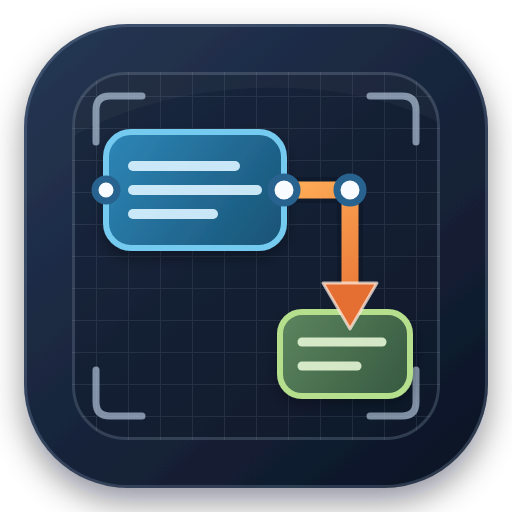
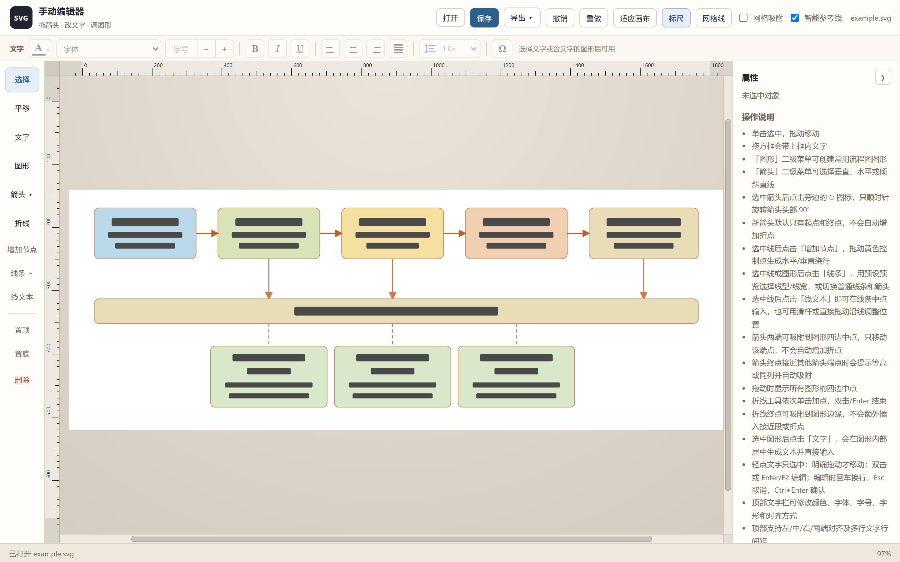

# SVG 手动编辑器

**比 PPT 更顺手的科研矢量绘图。** 在 Cursor / VS Code 里让 Agent 出图，再在画布上像改 PPT 一样拖一拖——不满意就手动改，改完还是矢量图，人和 AI 来回协作。

专为研究生科研绘图：机制图、流程图、框架图、实验方案图，任意形式都可以。

## 为什么不用 PPT 硬画

PPT 改一张机制图，对齐靠眼、箭头易歪、放大就糊、投稿还得另导出。这里不一样：

- **对齐和等距是磁性的**：边缘、中心、同宽同高、等间距会自动吸住，比在幻灯片里对格子快得多
- **箭头会粘在框上**：图形一挪，线跟着走，不用重新拉
- **永远是矢量 SVG**：答辩投影、期刊印刷、放大局部都清晰；导出 PNG / JPEG / WebP 也按矢量渲染，不是把糊图放大
- **改完即文件**：画布写回当前 `.svg`，没有「嵌入对象拆不开」的问题

## 人和 AI 一起画，而不是二选一

科研绘图最烦的是：Agent 能出图，但细节不对；自己用 PPT 画，又慢又难改版本。

把这两者接上：

1. **让 Agent 先画**：在 Cursor / VS Code 里说明论文结构、配色和标注，生成 SVG（框架图、技术路线、模型结构、实验流程都可以）
2. **你在画布上改**：用本编辑器打开，拖框、改字、拉箭头、对齐，几分钟改到能投稿
3. **不满意就继续**：你改过的还是标准 SVG。Agent 可以接着改文件，你也可以再打开画布微调——同一张图，人和 AI 来回接力

Agent 负责「从零到有、从有到多种方案」，你负责「像改 PPT 一样把最后 10% 摆到位」。这才是研究生真正用得上的出图方式。

## 安装 VSIX

从 [Releases](https://github.com/boringcat520/svg-manual-editor/releases) 下载 `svg-manual-editor-0.1.10.vsix`，然后任选一种方式安装：

- **Cursor / VS Code：** 扩展面板 → `⋯` → **Install from VSIX…**，选中下载的 `.vsix`
- **命令行：** `code --install-extension svg-manual-editor-0.1.10.vsix`（Cursor 可用 `cursor --install-extension`）

安装后重启编辑器，在资源管理器里对 `.svg` 右键 → **用 SVG 手动编辑器打开**。

本地开发也可在本目录运行 `.\install-extension.ps1`，或按 `F5` 启动「运行 SVG 手动编辑器扩展」。

扩展使用自管理 SVG 文档，绕过 Cursor 某些版本恢复自定义文本编辑器时的 `Unable to retrieve document` 问题。你在画布上的修改会自动写回当前 SVG；Agent 改了同一个文件，打开的画布也会自动刷新——人和 AI 始终在改同一张矢量图。

## 在浏览器里用

双击 `启动编辑器.bat`（需已安装 Python），或把 SVG 拖进画布 / 点「打开」。

## 常用操作

| 操作 | 方式 |
| --- | --- |
| 移动方框（带框内文字） | 选择工具下拖动矩形 |
| 添加流程图图形 | 打开左侧「图形」二级菜单，可选矩形、圆角矩形、圆/椭圆、判断菱形、输入输出平行四边形和开始结束终止符 |
| 显示标尺 | 点击顶部「标尺」按钮，在画布顶边和左边显示随缩放、平移更新的标尺 |
| 显示/隐藏网格 | 点击顶部「网格线」按钮 |
| 记住编辑器偏好 | 网格线、网格吸附、智能参考线、箭头方向、导出格式/清晰度/背景和属性栏状态会自动保存，下次打开继续使用 |
| 水平/垂直移动画布 | 拖动画布底部或右侧的滚动条，也可点击轨道快速跳转 |
| 收起/展开属性栏 | 点击右侧「属性」标题旁的箭头，收起后画布会自动扩展，选择会自动记住 |
| 导出高清图片 | 单击顶部「导出」可选择 SVG、PNG、JPEG 或 WebP；位图按目标像素直接渲染矢量（不是放大糊图），支持 1×/2×/4×/8×，PNG/WebP 可选透明或白色背景；双击「导出」会按当前设置直接导出到 SVG 所在文件夹 |
| 对齐边缘或中心 | 拖动时跟随智能参考线自动吸附 |
| 设置水平/垂直等距 | 把图形拖到相邻图形之间或队列末端，跟随粉色距离标记 |
| 匹配图形宽高 | 拖动图形边或角点调整大小，接近其他图形尺寸时自动吸附；同高显示水平贯穿线，同宽显示垂直贯穿线；按住 Ctrl 则按原比例等高等宽缩放 |
| 临时关闭智能吸附 | 拖动时按住 Alt |
| 新建箭头 | 打开「箭头」二级菜单，选择垂直直线、水平直线或倾斜直线后拖动；新箭头始终只有起点和终点，不会自动产生折点 |
| 手动改变线条转向 | 选中直线、箭头或折线后点击左侧「增加节点」，最长线段上会出现黄色正交控制点；错列端点默认生成最短三段式折线，同列端点需要绕行时才生成双折返，可重复增加节点 |
| 线条样式 | 选中直线、箭头、折线或图形后点击左侧「线条」；可选无线条、实线/虚线/点线/点划线的粗细预览，以及普通线条、终点/起点/两端箭头 |
| 对齐箭头端点 | 新建或拖动箭头终点时，接近其他箭头端点会出现蓝色「端点等高/端点同列」参考线并磁性吸附；按住 Alt 可临时关闭 |
| 调整箭头 / 折线箭头 | 选中后直接拖两端或已有节点；编辑器不会在拖动时偷偷增加折点 |
| 修改箭头样式 | 在右侧修改描边颜色、线宽、实线/虚线/点线、拐角和箭头位置；填充和描边使用与文字相同的颜色菜单（主题色、标准色、最近使用、渐变、更多颜色和取色器）；箭头会自动跟随线身颜色 |
| 在线条上插入文字 | 选中直线、箭头或折线后点击左侧「线文本」，即可在中点直接输入；也可双击线条或使用右侧属性，用 0–100% 滑杆及直接拖动调整位置 |
| 箭头连接图形 | 新建箭头或拖动箭头端点，靠近图形上/右/下/左中点后自动吸附；吸附只移动当前端点，即使两端不在同一行/列也绝不自动增加折点 |
| 端点粘连图形 | 端点吸附到某条边后会记住这条边，之后移动、方向键微调或缩放该图形时箭头端点自动跟随；只有被移动图形那一端会重算，手工加的折点保持不动；两端图形一起移动时整条线平移；把端点拖离图形即解除粘连 |
| 旧图自动识别粘连 | 打开已有 SVG 时，端点正好落在某条边中点上的箭头会自动获得粘连，无需重新拖一遍 |
| 显示连接中点 | 拖动箭头、折线折点或任意图形时，自动显示所有图形的上/右/下/左中点，松开后消失 |
| 正交控制节点 | 垂直段上的黄色控制点只需左右拖动，水平段上的只需上下拖动；编辑器会联动内部成对拐角，避免出现意外的 V 形斜线 |
| 折点智能吸附 | 拖动黄色正交控制点时，会优先吸附到本线起终点、图形连接中点及其他箭头端点的同行/同列位置；按住 Alt 可临时关闭 |
| 正交折线 | 折线工具的起点和终点可吸附到图形四边中点及其他箭头端点；完成后节点按水平/垂直关系联动，不能拖成 V 形 |
| 箭头头部旋转 | 选中箭头后点击选框旁的旋转图标，只将箭头头部顺时针旋转 90°，线条、折点和线文字保持原位；连续四次恢复自动方向 |
| 图形边缘方向 | 吸附到图形边后箭头头部恢复自动朝向，沿最后一段指向该端点；不会为了垂直进入而插入折点 |
| 线文字居中 | 通过「线文本」插入的文字中心直接落在线条上，可沿整条线前后拖动；折线调整或旋转后仍保持在线上 |
| 手动绘制折线 | 依次单击确认折点，移动鼠标时只显示当前预览；双击或 Enter 完成，Esc 取消 |
| 选择、移动和编辑文字 | 轻点只选中，鼠标移动超过防误触距离后才会拖动；双击或选中后按 Enter/F2 打开编辑框，内容会自动选中，便于 Ctrl+C 复制；也可使用右侧「内容」 |
| 缩放后编辑文字 | 编辑框会跟随当前画布缩放匹配实际字号，并自动扩展以避免出现滚动条或裁切文字 |
| 设置文字格式 | 选中文字或含文字的图形，在顶部工具栏修改文字颜色、字体、字号、加粗、斜体、下划线及左/中/右对齐；颜色菜单提供自动色、主题色、标准色、最近使用、渐变、更多填充色（侧栏渐变预设）、其他颜色对话框（标准/自定义/高级）和取色器；用过的颜色会记在「最近使用」里；多选时会统一应用 |
| 两端对齐和行间距 | 顶部提供标准左/中/右/两端对齐图标；多行文字可设置 1.0×、1.15×、1.2×、1.5×、2.0×、2.5× 或 3.0× 行距，按所属图形分别排版 |
| 删文字/图形 | 选中后 Delete |
| 线条 / 折线 / 文字 / 图形 | 左侧工具 |
| 撤销 | Ctrl+Z |
